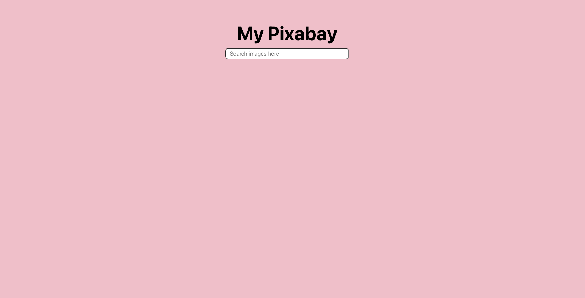
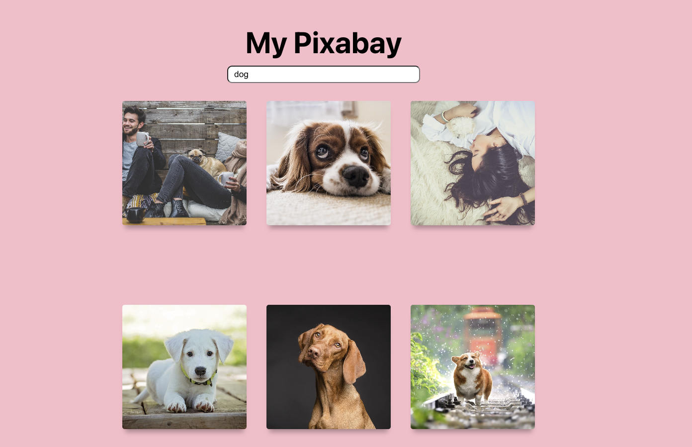
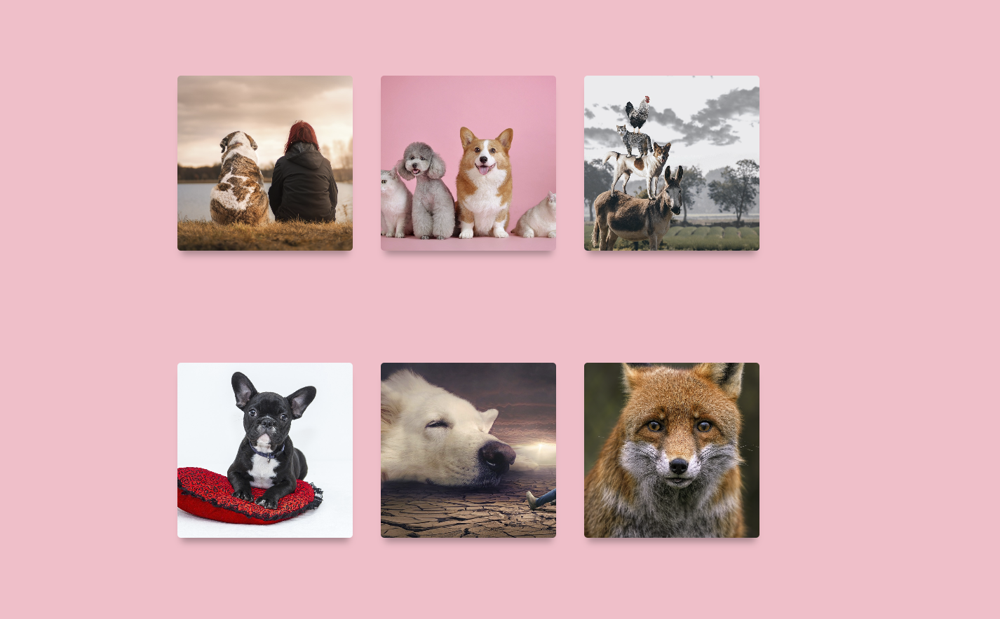
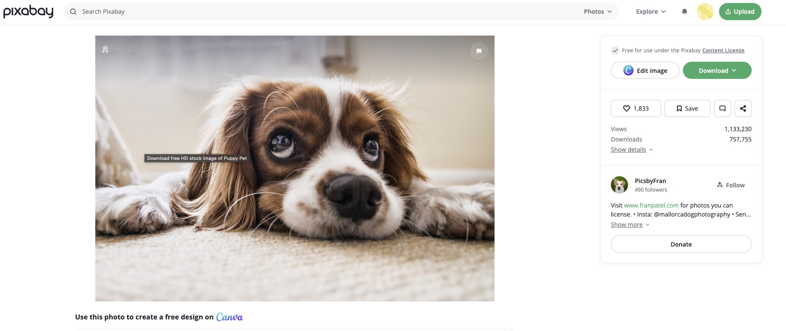

# Image-Search-App
## Deployed site : 
## OVERVIEW
I built an image search application using Pixabay's open API. Users can retrieve relevant twenty images by typing in the search field. In addition, clicking on an individual image will redirect you to the original URL of that image.
## Screenshots 
Homepage

Search Result-1

Search Result-2

Pixabay Page 

## Tech stack 
- ReactJS
- Javascript
- HTML5
- CSS3
- Netlify 